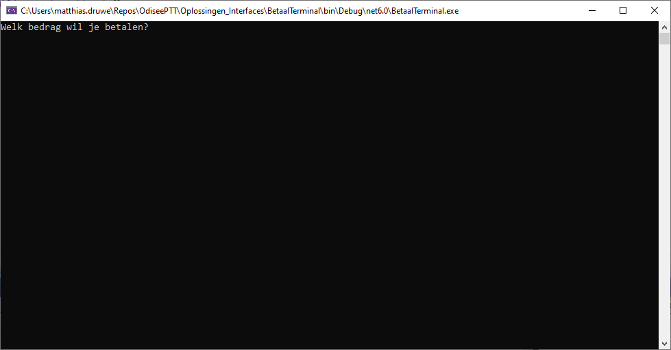
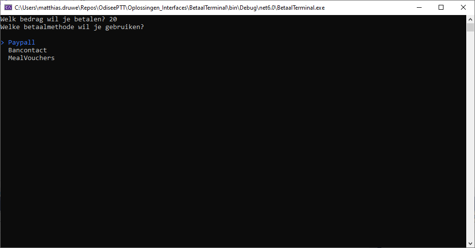
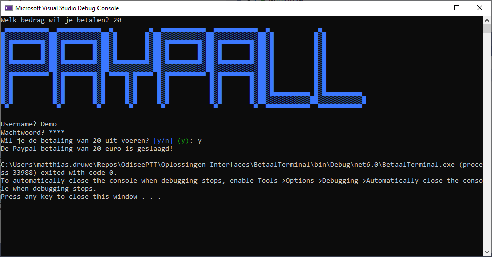
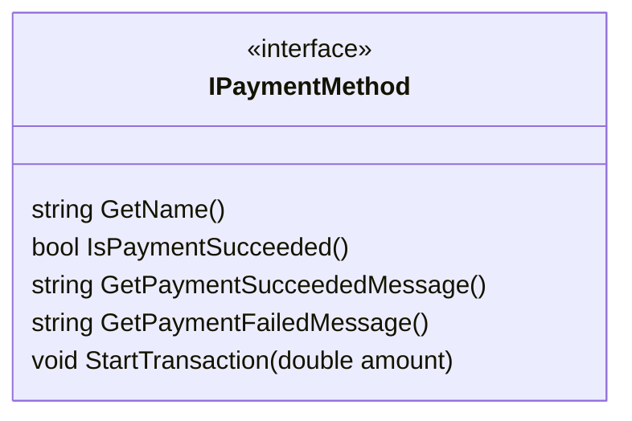
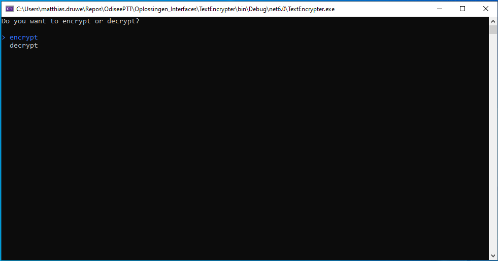
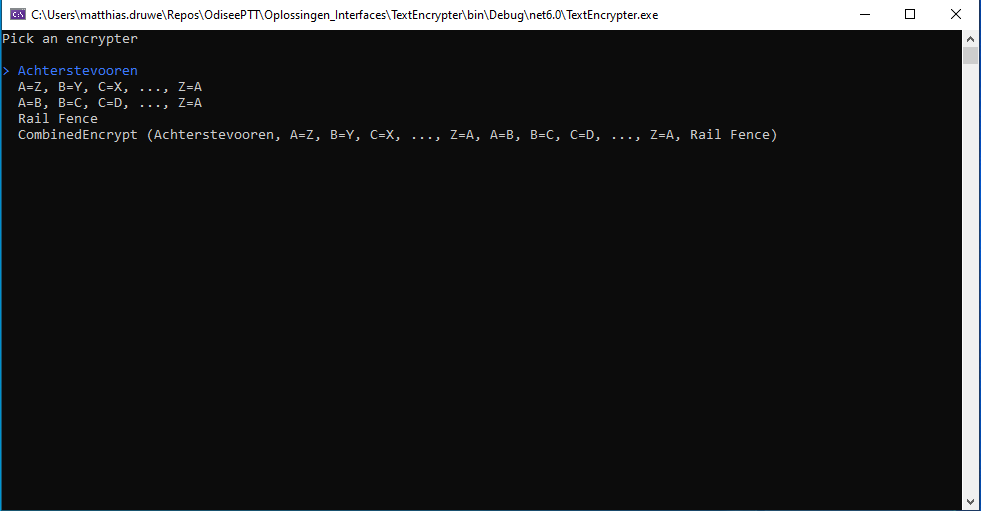
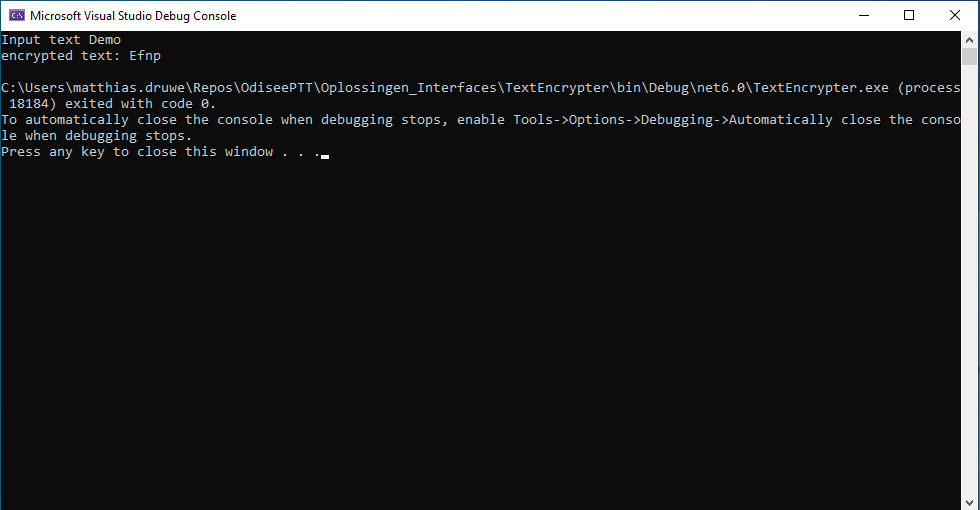

# Oefeningen Interfaces

Deze oefeningen maak je individueel. Maak de oefeningen in de reeds voorziene solution.

## Aanmaken interfaces

Schrijf een interface voor onderstaande situaties:

- Een interface die er voor zorgt dat we tekst van een file kunnen inlezen en wegschrijven. Deze interface noem je IFile
- Een interface voor een notificatie in je smartphone. Elke notificatie bestaat uit een logo, titel en beschrijving. Je kan ook op een notificatie klikken. Noem deze interface INotification.
- Interface die ervoor zorgt we checkboxen/radiobuttons kunnen printen op het scherm. We verwachten hier een Select en Deselect functie. We willen ook weten of een item geselecteerd is of niet.

Voorzie telkens een klasse die je gemaakte interfaces implementeert. Je hoeft hiervoor de logica niet te schrijven.

## Betaalterminal

Schrijf een console applicatie die een betaal terminal simuleert. In de terminal wordt een bedrag gevraagd gevolgd door de betaalwijze. Afhankelijk van de betaalwijze wordt een andere flow gevolgd.

### Console

Je mag de applicatie maken met behulp van [Spectre Console](https://spectreconsole.net/). Hieronder enkele screenshots ter inspiratie. Je bent vrij te kiezen hoe je dit aanpakt.

Bij opstart van de applicatie wordt gevraagd om een bedrag in te geven. Er kan enkel een double getal ingegeven worden.

Nadat het bedrag ingevuld is wordt er gevraagd welke betaalwijze er gebruikt moet worden.

Afhankelijk van de betaalwijze worden enkele bijkomende vragen gesteld (zie [interface implementaties](#interface-implementaties)).

Tot slot wordt afhankelijk of de betaling geslaagd is of niet een bijhorende boodschap getoond.

### Interface

We willen een betaalinterface. We noemen deze IPaymentMethode. Deze interface zal ervoor zorgen dat alle betaal implementaties een zelfde publieke interface hebben.

Van elke betaalmethode willen volgende zaken weten/kunnen:

- naam van de methode
- een boolean die aangeeft of de betaling geslaagd is
- een bericht dat we willen laten zien wanneer de betaling geslaagd is
- een bericht dat we willen laten zien wanneer de betaling niet geslaagd is.
- een methode om het betaalproces op te starten.

De interface zal er dan als volgt uit zien.

De methodes GetName, IsPaymentSucceeded, GetPaymentSucceededMessage en GetPaymentFailedMessage mogen in dit geval ook door properties vervangen worden. Maar om aan te duiden dat we enkel een publieke Get willen, zijn deze als methodes gedefinieerd.

### Interface implementaties

## Text encrypter

Schrijf een console applicatie die helpt om tekst te encrypteren en decrypteren. Zorg ervoor dat de gebruiker keuze heeft uit verschillende versleutel technieken die elk eenzelfde publieke interface delen.

### Console

Je mag de applicatie maken met behulp van [Spectre Console](https://spectreconsole.net/). Hieronder enkele screenshots ter inspiratie. Je bent vrij te kiezen hoe je dit aanpakt.

In de applicatie heb je bij opstart de keuze of je wil encrypteren of decrypteren.

Na deze keuze kan je kiezen welke encryptie techniek je wilt gebruiken.

Op het laatste scherm wordt er gevraagd welke tekst je wil encrypteren/decrypteren. Het resultaat hierna getoond.

### Interface

Voorzie zelf een interface die nuttig lijkt!

### Gebruik Interface

Maak minsten 3 encryptie/decryptie klasses die je gemaakte interface implementeren.

**Klasse 1**
De eerste klasse die je maakt zet de tekst achterstevoren. Met andere woorden Auto wordt otuA.

**Klasse 2**
De tweede klasse die je maakt, schuift alle letters in het alfabet eentje opzij. Auto wordt in dit geval Bvup.

**Klasse 3**
De derde klasse die je maakt, gebruikt het alfabet achterstevoren. A wordt Z en Z wordt A. Auto wordt in dit geval Zfgl.

In eender welk geval, pas je enkel de letters aan. Cijfers, leestekens, witruimte blijven steeds dezelfde. De positie hiervan kan wel veranderen.

### Extra

- Voorzie zelf een extra encryptie methode. (je kan [hier](http://www.crypto-it.net/eng/simple/index.html) inspiratie vinden)

- Voorzie een encryptie-methode die een combinatie vormt van reeds bestaande encryptie-methodes.
